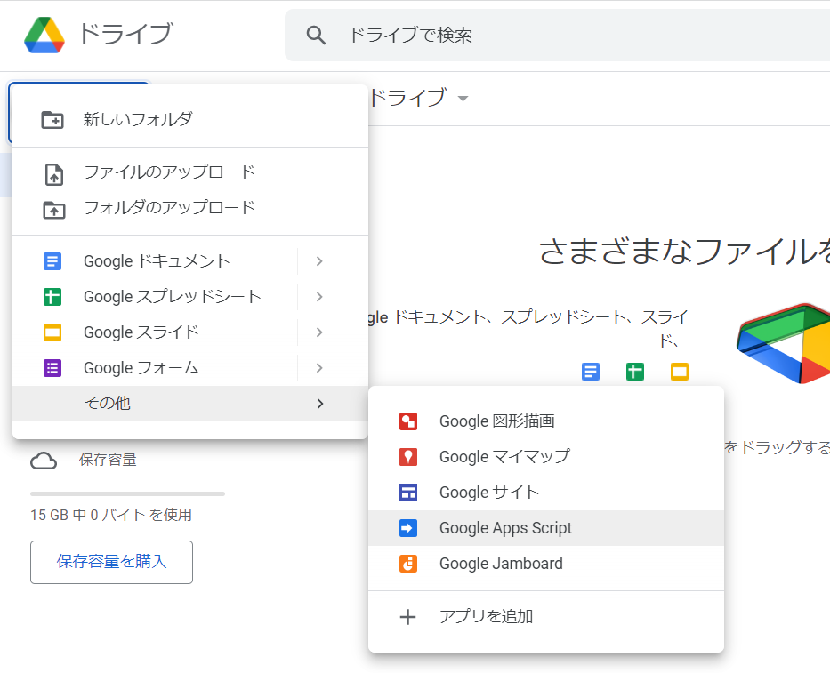

<!--
title:   【GAS】リンクを踏んだらGitHub Actionsを実行するようにしてみる
tags:    GAS,GitHubActions,備忘録
id:      3d87fc94fd3c4d6e71ee
private: true
-->
# はじめに

GitHub Actionsを利用する機会が多かったのですが、外部から実行する方法が分からず困っていました。

そこでGitHub Actionsのドキュメントを見ていたところ、ワークフローを実行させるイベントの中に```repository_dispatch```というものが存在することを知りました。

https://docs.github.com/en/actions/using-workflows/events-that-trigger-workflows#repository_dispatch

<br>
「これ使えば外部から実行できんじゃね？」と思ったので試してみました。

## 対象
- GitHub Actionsの基本は分かっている
- "GAS"を聞いたことがある、使ったことがある

# 1.GitHub Personal Access Tokenの取得
外部からGitHub Actionsを実行するためには、GitHub Personal Access Tokenが必要です。取得方法は
次の記事様に詳しく書かれてあります。

https://qiita.com/P-man_Brown/items/833c5ee114920db079a2

<br>

こんな感じでチェックを付ければOKです。


# 2.GAS

## 2-1.GASの作成
GoogleドライブからGoogle App Scriptを開いてください。


## 2-2.環境変数の設定
スクリプトにトークンをそのまま貼り付けるとセキュリティ的に非常にマズイので、トークンを環境変数として設定します。


プロジェクトの設定→スクリプトプロパティ→スクリプトプロパティを追加 を押します。
プロパティに```TOKEN```、値に先ほど取得したトークンを入力し終えたら"スクリプトプロパティを保存"をおしてください。(画像の値はサンプルです)

## 2-3.スクリプトの作成
```コード.gs```に以下のコードを貼り付けてください。

```javascript:コード.gs
function doGet() {
  const headers = {
    'Authorization': 'token ' + PropertiesService.getScriptProperties().getProperty('TOKEN'),
    'Accept' : 'application/vnd.github.everest-preview+json',
    'Content-Type': 'application/x-www-form-urlencoded',
  };
  const data = {
    'event_type': '<イベント名>'
  };
  const options = {
    'method': 'post',
    'payload': JSON.stringify(data),
    'headers': headers
  };
  UrlFetchApp.fetch('https://api.github.com/repos/<ユーザー名>/<リポジトリ名>/dispatches', options);
}
```

<>がついている部分は自分の環境に合わせて置き換えてください。(置き換えたら<>は削除)
- ```<イベント名>```: 任意の名前
- ```<ユーザー名>```: GitHubのユーザー名
- ```<リポジトリ名>```: リポジトリ名

以下、```<イベント名>```を```test```として説明します。

# 3.GitHub Actionsのymlファイルの設定