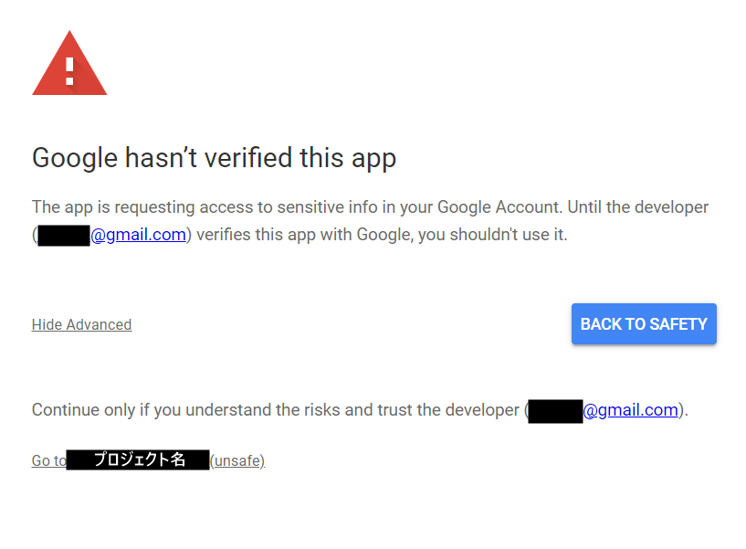
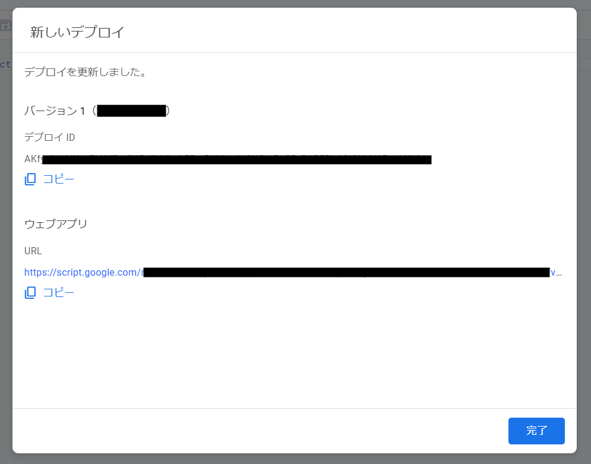

<!--
title:   【GAS】リンクを踏んだらGitHub Actionsを実行するようにしてみる
tags:    GAS,GitHubActions,備忘録
id:      3d87fc94fd3c4d6e71ee
private: true
-->
# はじめに

GitHub Actionsを利用する機会が多かったのですが、外部から実行する方法が分からなかった為わざわざリポジトリのページを開いて実行しており、だいぶ困っていました。

ある日、GitHub Actionsのドキュメントを見ていたところ、ワークフローを実行させるイベントの中に```repository_dispatch```というものが存在することを知りました。

https://docs.github.com/en/actions/using-workflows/events-that-trigger-workflows#repository_dispatch

<br>
「これ使えば『リンク踏んだら実行』みたいなことできんじゃね？」と思ったので試してみました。

## 対象
- GitHub Actionsの基本は分かっている人

# 1.GitHub Personal Access Tokenの取得
外部からGitHub Actionsを実行するためには、GitHub Personal Access Tokenが必要です。取得方法は
次の記事様に詳しく書かれてあります。

https://qiita.com/P-man_Brown/items/833c5ee114920db079a2

<br>

こんな感じでチェックを付ければOKです。


# 2.GAS

## 2-1.GASへ移動
GoogleドライブからGoogle App Scriptを開いてください。


## 2-2.環境変数の設定
スクリプトにトークンをそのまま貼り付けるとセキュリティ的に非常にマズイので、先程取得したトークンを環境変数として設定します。


プロジェクトの設定→スクリプトプロパティ→スクリプトプロパティを追加 を押します。
プロパティに```TOKEN```、値に先ほど取得したトークンを入力し終えたら"スクリプトプロパティを保存"をおしてください。(画像の値はサンプルです)

## 2-3.スクリプトの作成
```コード.gs```に以下のコードを貼り付けてください。

```javascript:コード.gs
function doGet() {
  const headers = {
    'Authorization': 'token ' + PropertiesService.getScriptProperties().getProperty('TOKEN'),
    'Accept' : 'application/vnd.github.everest-preview+json',
    'Content-Type': 'application/x-www-form-urlencoded',
  };
  const data = {
    'event_type': '<イベント名>'
  };
  const options = {
    'method': 'post',
    'payload': JSON.stringify(data),
    'headers': headers
  };
  UrlFetchApp.fetch('https://api.github.com/repos/<ユーザー名>/<リポジトリ名>/dispatches', options);
}
```

<>がついている部分は自分の環境に合わせて置き換えてください。(置き換えたら<>は削除)
- ```<イベント名>```: 任意の名前
- ```<ユーザー名>```: GitHubのユーザー名
- ```<リポジトリ名>```: リポジトリ名

以下、```<イベント名>```を```test```として説明します。

## 2-4.deploy

"デプロイ"→"新しいデプロイを作成"を押します。
デプロイタイプの選択を求められるので、設定マークを押して"ウェブアプリ"を選択してください。
新しい説明文はテキトーに入力し、"アクセスできるユーザー"を"全員"にしてデプロイを押します。


初回はデータへのアクセスを許可する必要があるので、"アクセスを承認"を押してください。
Googleアカウントにログイン後、以下のような画面が出てくるので"Advanced"→"GO to <プロジェクト名>(unsafe)"→"Allow"を押してください。



そしたらデプロイ完了です。urlはコピーしておいてください。



# 3.GitHub Actionsのymlファイルの設定

GitHub Actionsのymlファイルを以下のようにします。

```yml:./.github/workflows/workflow.yml
name: <任意>
on:
  repository_dispatch:
    types: test

jobs:
# 以下省略
```

typesの部分に```<イベント名>```を入力します。
今回の場合```<イベント名>```が```test```なので、上のようになります。

これで準備は完了です。先程コピーしたurlを開くとGitHub Actionsが実行されます。

# 4.完了画面の追加(任意)

先程のコードの状態でurlを開き、実行に成功すると以下のような画面が表示されます。


このままだと寂しいので、最後の行に成功画面を表示するコードを追加します。「この画面のままでもいい」という方は飛ばして大丈夫です。

```javascript:コード.gs
function doGet() {

  /*省略*/

  const options = {
    'method': 'post',
    'payload': JSON.stringify(data),
    'headers': headers
  };

  UrlFetchApp.fetch('https://api.github.com/repos/<ユーザー名>/<リポジトリ名>/dispatches', options);

  const html = '<p>実行完了</p>';
  return HtmlService.createHtmlOutput(html);
}
```

```html```には、HTML文を文字列で構成して代入しています。
そしてHtmlOutputオブジェクトをリターンすることで、```html```の内容を反映したWebページを表示させることができます。
```html```の内容は自由に変更してください。

コードを追加し終えたら再度デプロイを行い、urlを開いてみてください。
すると...


...寂しさはあまり変わっていませんが、ちゃんと実行完了されたのが分かるようになったので多少マシにはなったかもしれません。
