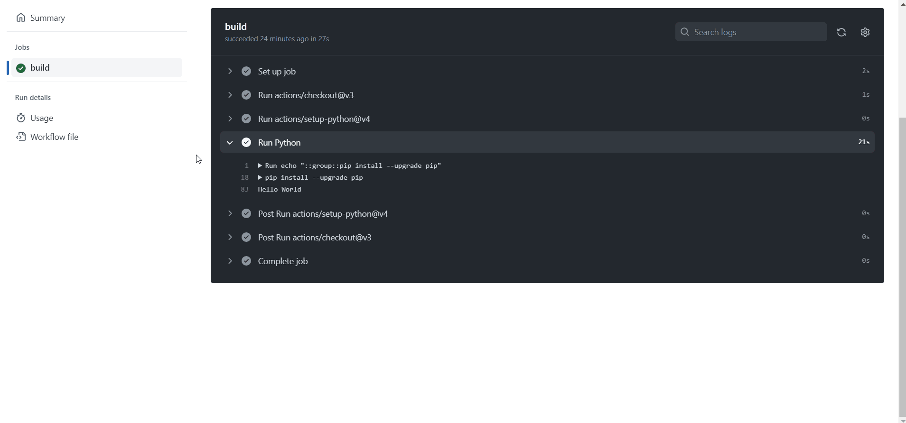

<!--
title:   【GitHub Actions】ログ出力をグループ化して見やすくする
tags:    GitHubActions,備忘録,初心者
id:      ab24d8e571587fa0ef13
private: false
-->
# はじめに

僕は今まで「GitHub Actionsのログ出力が見づらい問題」に悩まされていました。
唐突ですが、以下のworkflowを実行してみましょう。

```yml:main.yml
name: main
on:
  workflow_dispatch:

jobs:
  build:
    runs-on: ubuntu-latest
    timeout-minutes: 5
    steps:
      - uses: actions/checkout@v3
      - uses: actions/setup-python@v4
        with:
          python-version: '3.x'
          architecture: 'x64'
      - name: Run Python
        run: |
          python -m pip install --upgrade pip
          pip install opencv-python
          pip install Pillow
          pip install python-dotenv
          pip install selenium
          python main.py
```

パッケージはログ出力の見づらさが伝われば良いので、テキトーに選びました。
main.pyは以下のようになっています。

```python:main.py
print('Hello World')
```

実行すると以下のようになりました。


...見づらいです。ぱっと見「Hello World」がどこにあるのか分かりません。
どうにかしてログ出力を見やすくする方法はないかと調べていたところ、公式のドキュメントで以下のようなものを見つけました。

https://docs.github.com/en/actions/using-workflows/workflow-commands-for-github-actions#grouping-log-lines

```group```を使えばログ出力をグループ化することができるようです。

何故かこれに関する記事がQiitaで1つも見つからなかったので、備忘録として残しておきます。

# 1.ymlファイルの修正

main.ymlを以下のように修正します。(2行加えるだけですが...)

```yml:main.yml
      # 省略
      - name: Run Python
        run: |
          echo "::group::pip install --upgrade pip"
          python -m pip install --upgrade pip
          pip install opencv-python
          pip install Pillow
          pip install python-dotenv
          pip install selenium
          echo "::endgroup::"
          python main.py
```

```echo "::group::<グループ名>"```でログ出力をグループ化できます。(グループ名は任意)
```echo "::endgroup::"```でグループ化を終了します。

# 2.実行

実行すると以下のようになりました。


すごくスッキリしました。
グループ名の部分を押すと展開できます。



# 例

以下のリポジトリに今回のコードが置いてあります。

https://github.com/Geusen/log_group