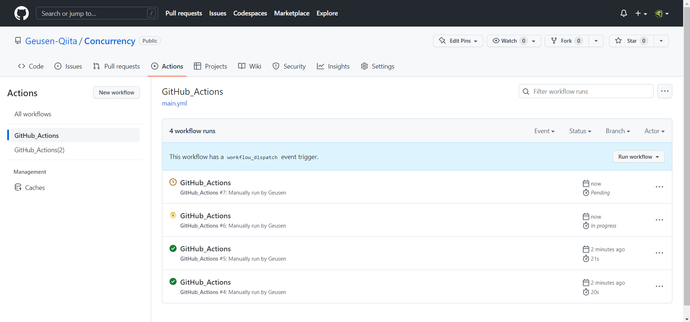
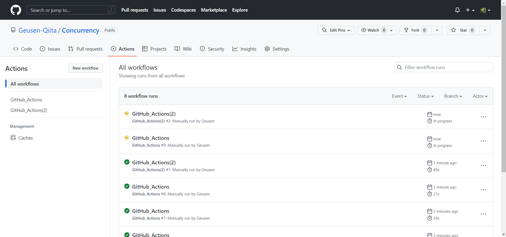
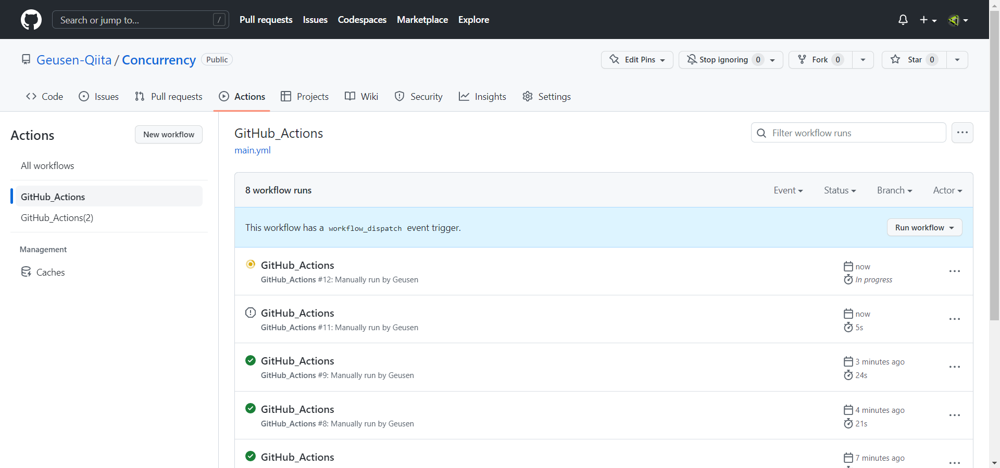
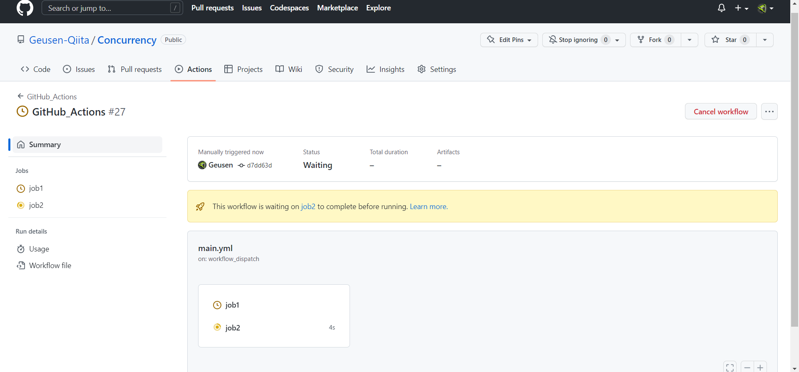
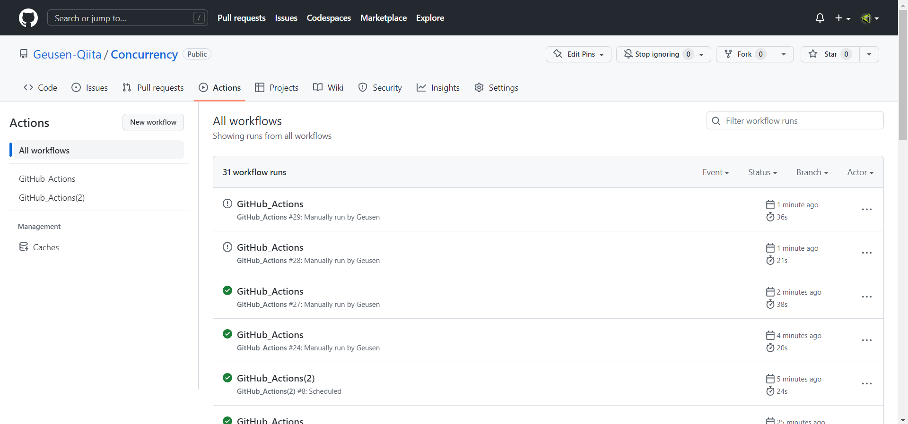

<!--
title:   【GitHub Actions】Workflowを同時に実行しないようにする
tags:    GitHubActions,備忘録
id:      f6610e6d5d5e2f063c87
private: true
-->

# はじめに

公式ドキュメントを読んでいたところ、以下のような記述を見つけました。

https://docs.github.com/en/actions/using-jobs/using-concurrency

同じジョブ、ワークフローを同時に実行しないようにできるそうです。

今回は以下のワークフローを同時に実行しないようにしてみます。

```yaml:main.yml
name: GitHub_Actions
on:
  workflow_dispatch:
  schedule:
    - cron: '*/30 * * * *'

jobs:
  build:
    runs-on: ubuntu-latest
    steps:
      - name: Hello World
        run: |
          echo 'Hello'
          sleep 10
          echo 'World'
```


# 1.ワークフローレベル

## 1-1.保留にしたい場合

```yaml:main.yml
name: GitHub_Actions
on:
  workflow_dispatch:
  schedule:
    - cron: '*/30 * * * *'
concurrency: test

jobs:
  build:
    runs-on: ubuntu-latest
    steps:
      - name: Hello World
        run: |
          echo 'Hello'
          sleep 10
          echo 'World'
```



```yaml:main2.yml
name: GitHub_Actions(2)
on:
  workflow_dispatch:
  schedule:
    - cron: '*/30 * * * *'
concurrency: test

jobs:
  build:
    runs-on: ubuntu-latest
    steps:
      - name: hoge fuga
        run: |
          echo 'hoge'
          sleep 10
          echo 'fuga'
```


```yaml:main2.yml
name: GitHub_Actions(2)
on:
  workflow_dispatch:
  schedule:
    - cron: '*/30 * * * *'
concurrency: test2

jobs:
  build:
    runs-on: ubuntu-latest
    steps:
      - name: hoge fuga
        run: |
          echo 'hoge'
          sleep 10
          echo 'fuga'
```



リポジトリ内にあるワークフローが1つだけなら上のままで良いですが、複数ある場合は```group: ${{ github.workflow }}-${{ github.ref }}```とする必要があります。

# 1-2.キャンセルしたい場合

```cancel-in-progress: true```を追加するだけです。

```yaml:main.yml
name: GitHub_Actions
on:
  workflow_dispatch:
  schedule:
    - cron: '*/30 * * * *'
concurrency:
    group: test
    cancel-in-progress: true

jobs:
  build:
    runs-on: ubuntu-latest
    steps:
      - name: Hello World
        run: |
          echo 'Hello'
          sleep 10
          echo 'World'
```



先程同様、別のワークフローにも```cancel-in-progress: true```を追加してもキャンセルできます。

# 2.ジョブレベル

## 2-1.保留にしたい場合

```concurrency```をジョブレベルで設定することもできます。


```yaml:main.yml
name: GitHub_Actions
on:
  workflow_dispatch:
  schedule:
    - cron: '*/30 * * * *'

jobs:
  job1:
    runs-on: ubuntu-latest
    concurrency: test
    steps:
      - name: Hello World
        run: |
          echo 'Hello'
          sleep 10
          echo 'World'
  job2:
    runs-on: ubuntu-latest
    concurrency: test
    steps:
      - name: hoge fuga
        run: |
          echo 'hoge'
          sleep 10
          echo 'fuga'
```



同じワークフローを2回実行




## 2-2.キャンセルしたい場合

```cancel-in-progress: true```を追加するだけです。

```yaml:main.yml
name: GitHub_Actions
on:
  workflow_dispatch:
  schedule:
    - cron: '*/30 * * * *'

jobs:
  job1:
    runs-on: ubuntu-latest
    concurrency:
      group: test
      cancel-in-progress: true
    steps:
      - name: Hello World
        run: |
          echo 'Hello'
          sleep 10
          echo 'World'
  job2:
    runs-on: ubuntu-latest
    concurrency:
      group: test
      cancel-in-progress: true
    steps:
      - name: hoge fuga
        run: |
          echo 'hoge'
          sleep 10
          echo 'fuga'
```


